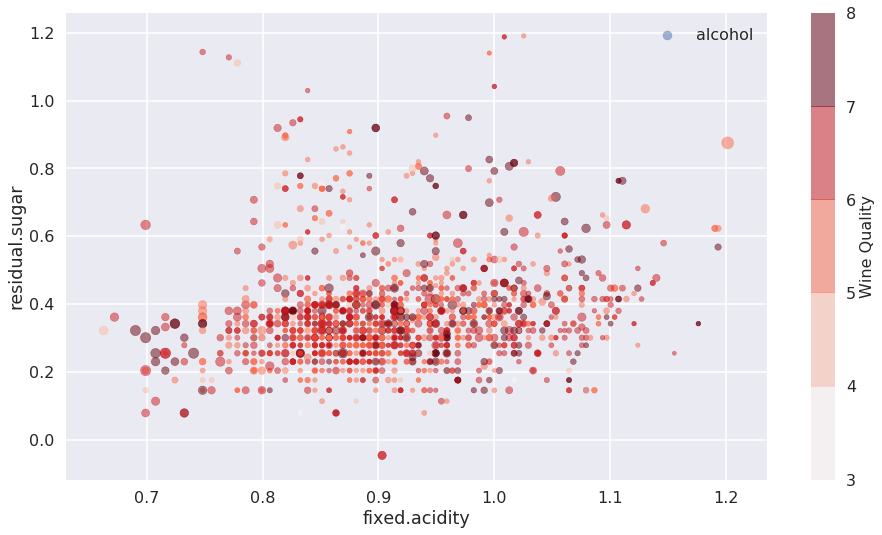

Figure 1. The scatter plot of a wine dataset from [kaggle]( https://www.kaggle.com/piyushgoyal443/red-wine-dataset#wineQualityReds.csv). The size stands for the alcohol percentage and the color map represents the wine quality. It shows that there does not exist a simple relation between acidity and residual sugar. 